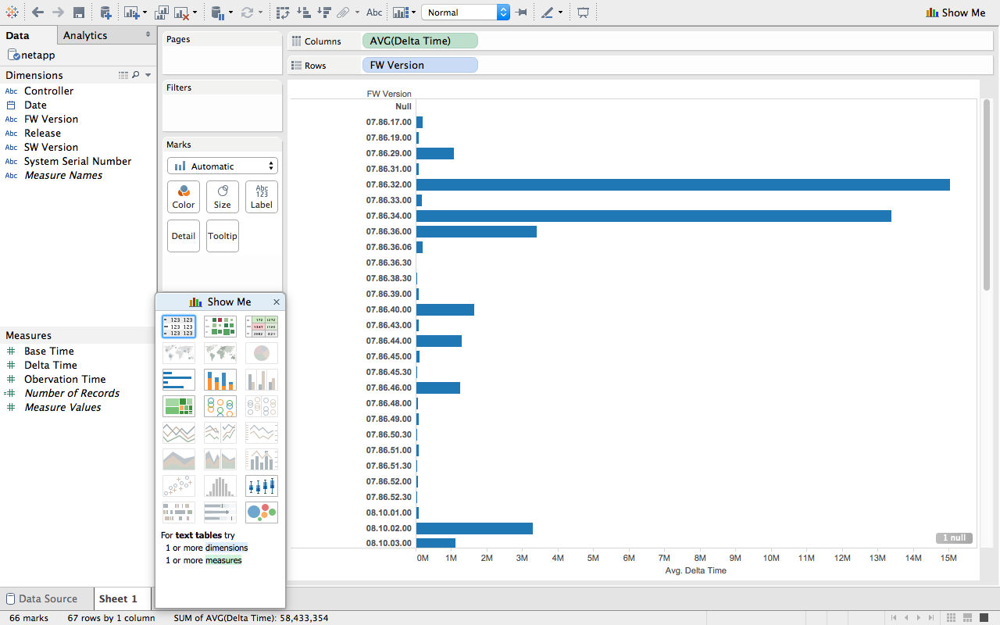
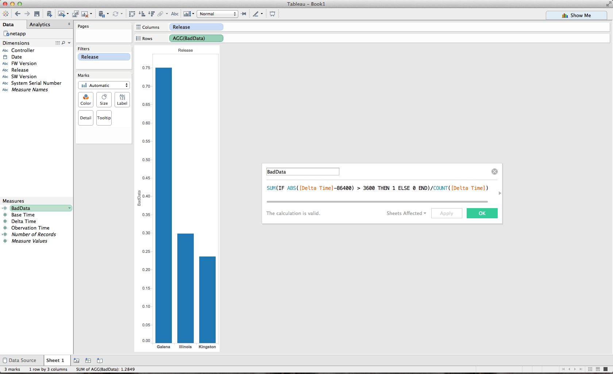
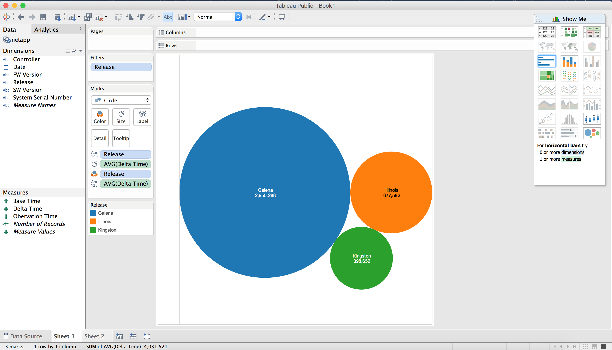
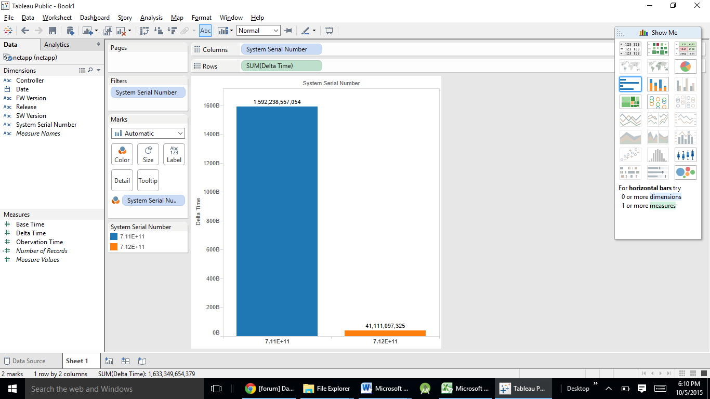
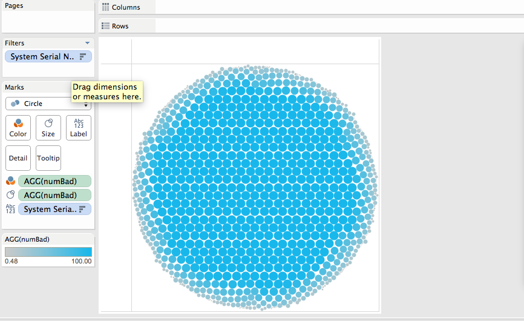

# NetApp

Brian McKean, a senior engineer at NetApp, gave a talk about his company in class.
He shared a data problem for our class to help solve.

# Tool
Tableau

# Authors

This report is prepared by
* [Tristan Wagar](www.github.com/twagar95)
* [John Murphy](www.github.com/johnmurph27)
* [Nicole Woytarowicz](www.github.com/nicolele)
* [Satchel Spencer](www.github.com/satchelspencer)
* [Sushant Mittal](www.github.com/sumi6109)

#What is the average delta of each Firmware?

#Which release contains the most entries with a non 24 hour period?

#Which release has the longest observation period on average?

#Which system took most time to transmit the data?

#What are the proble systems, those with the lowest percentage of useable data?

# Further Analysis

Our team determines the following questions are too complex for Tableau and
require custom scripts to be written.

* (Question)
* (Question)
* (Question)
* (Question)
